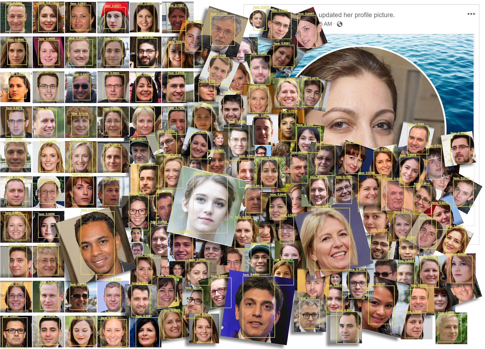
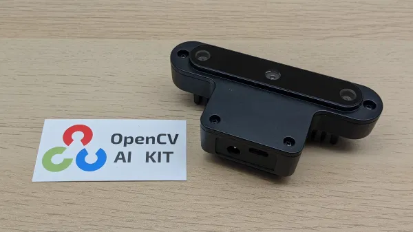
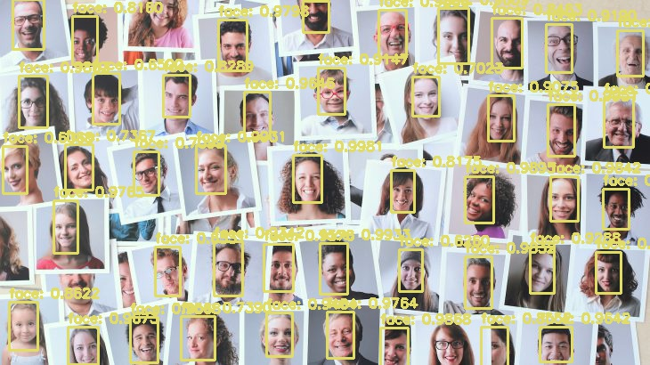
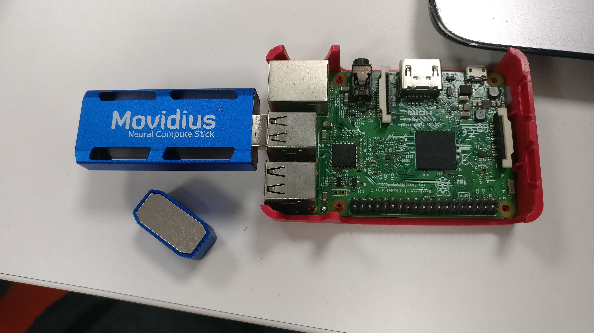
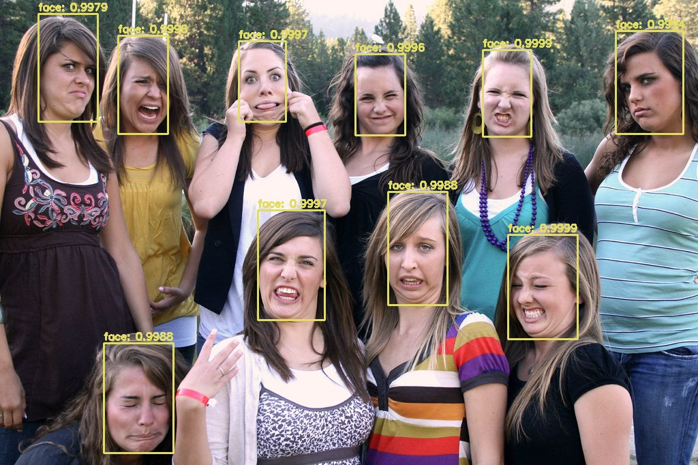

# yolov3-face-realtime

### YOLO face detection.

 

## What Is YOLO Object Detection and why?
  You Only Look Once (YOLO) is a network that uses Deep Learning (DL) algorithms for object detection. 
  YOLO performs object detection by classifying certain objects within the image and determining where they are located on it

## YOLO V3
   YOLO V3 is an incremental upgrade over YOLO V2, which uses another variant of Darknet. 
   This YOLO V3 architecture consists of 53 layers trained on Imagenet. even thoughyolov4, yolov5 has released ,still Yolo v3 is famous  
   and used in many industrial applications.

## Yolov3 specs:

 * Improved bounding box prediction
 * More accurate class predictions
 * Improved abilities at different scales

## training:

dataset used :[FDDB](http://vis-www.cs.umass.edu/fddb/) \
classes : 1\
classes name : face\
training duration : for yolv3  15+ hr,,,,  for tiny-yolov3 8+ hr\
gpu : goolge colab / tesla T4

# Usage

for YoloV3-face and Tiny-yolov3-face\
download and extract from this [Drive](https://drive.google.com/file/d/1FJLvxmPLqoGZnOU4rKTPEPvaG7vk6-Ui/view?usp=sharing)

output

### What is OpenCV AI kit?
The OpenCV AI Kit-D (OAK-D) is a cheapest and highly powerful smart camera with neural inference and depth processing capability. ... built -n Intel Movidius X VPU// with powerful myraid x chip inside ,and capability of SpatialAI is to apply AI in this real world by not only identifying the object but also understanding where it is in 3D space — in real time 

for YoloV3-face and Tiny-yolov3-face for OAK cameras\
download and extract from this [Drive](https://drive.google.com/file/d/16h0JsEe73dMYU75xGZHwGTmt1t1n-bW0/view?usp=sharing)

output

### What is Intel neural compute stick?
Product description. Intel Neural Compute Stick 2 is powered by the Intel Movidius X VPU to deliver industry leading performance, wattage, and power. The NEURAL COMPUTE supports OpenVINO, a toolkit that accelerates solution development and streamlines deployment.

for YoloV3-face and Tiny-yolov3-facefor Intel neural Stick 2 \
download and extract from this [Drive](https://drive.google.com/file/d/1v4a_oL6ncsBB5upnmyQ_MFSPzHdWriT8/view?usp=sharing)

enjoy ;p
